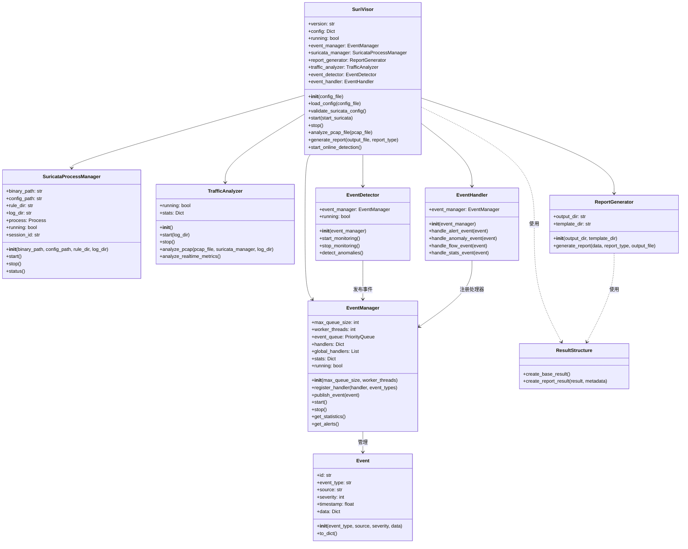

# SuriVisor主类实现分析

## 1. 概述

SuriVisor是一个基于Suricata的威胁分析系统，其主类`SuriVisor`作为整个系统的核心，负责初始化和协调各个组件。通过分析源代码，我们可以清晰地了解SuriVisor的架构设计和工作流程。

## 2. SuriVisor主类结构

### 2.1 主要属性

SuriVisor主类包含以下主要属性：

- `version`: 系统版本号
- `config`: 系统配置信息
- `running`: 系统运行状态
- `event_manager`: 事件管理器
- `suricata_manager`: Suricata进程管理器
- `report_generator`: 报告生成器
- `traffic_analyzer`: 流量分析器
- `event_detector`: 事件检测器
- `event_handler`: 事件处理器

### 2.2 初始化过程

SuriVisor的初始化过程主要包括：

1. 加载默认配置
2. 从配置文件加载用户配置（如果提供）
3. 设置日志级别
4. 验证Suricata配置
5. 初始化各个组件：
   - Suricata进程管理器
   - 流量分析器
   - 事件管理器
   - 事件检测器
   - 事件处理器
   - 报告生成器
6. 注册各类事件处理器

### 2.3 主要方法

#### 2.3.1 配置管理

- `load_config(config_file)`: 从文件加载配置
- `save_config(config_file)`: 保存配置到文件
- `validate_suricata_config()`: 验证Suricata配置文件

#### 2.3.2 系统控制

- `start(start_suricata=True)`: 启动系统
- `stop()`: 停止系统

#### 2.3.3 分析功能

- `analyze_pcap_file(pcap_file)`: 离线分析PCAP文件
- `generate_report(output_file=None, report_type="html")`: 生成系统报告
- `start_online_detection()`: 启动在线检测模式

## 3. 组件交互

SuriVisor主类通过协调各个组件之间的交互，实现系统的整体功能：

1. **启动流程**：
   - 启动Suricata进程（通过`suricata_manager`）
   - 启动流量分析器（`traffic_analyzer`）
   - 启动事件管理器（`event_manager`）
   - 启动事件检测（`event_detector`）

2. **事件处理流程**：
   - 事件检测器检测到事件
   - 事件被发送到事件管理器
   - 事件管理器根据事件类型分发给相应的事件处理器
   - 事件处理器处理事件

3. **报告生成流程**：
   - 收集流量分析器的统计数据
   - 收集事件管理器的告警信息
   - 使用报告生成器生成报告

## 4. 系统架构图

以下是SuriVisor系统的架构图，展示了SuriVisor主类与各个组件之间的关系：

## 5. 工作流程

### 5.1 离线分析模式

1. 用户选择PCAP文件
2. SuriVisor调用`analyze_pcap_file`方法
3. 使用Suricata进程管理器分析PCAP文件
4. 流量分析器处理分析结果
5. 生成分析报告

### 5.2 在线检测模式

1. 用户启动在线检测
2. SuriVisor调用`start_online_detection`方法
3. 启动Suricata进程监控网络流量
4. 流量分析器实时分析流量
5. 事件检测器检测异常
6. 事件管理器分发事件
7. 事件处理器处理事件
8. 用户可随时生成报告

## 6. 总结

SuriVisor主类作为系统的核心，通过组织和协调各个组件，实现了基于Suricata的网络威胁分析系统。其模块化的设计使得系统具有良好的扩展性和可维护性，能够满足离线分析和在线检测的不同需求。

系统的主要优势在于：

1. **模块化设计**：各个组件职责明确，相互独立
2. **灵活的配置**：支持从配置文件加载自定义配置
3. **多种分析模式**：支持离线分析和在线检测
4. **丰富的报告**：支持多种格式的报告生成

通过这种设计，SuriVisor能够有效地利用Suricata的强大功能，为用户提供全面的网络威胁分析能力。