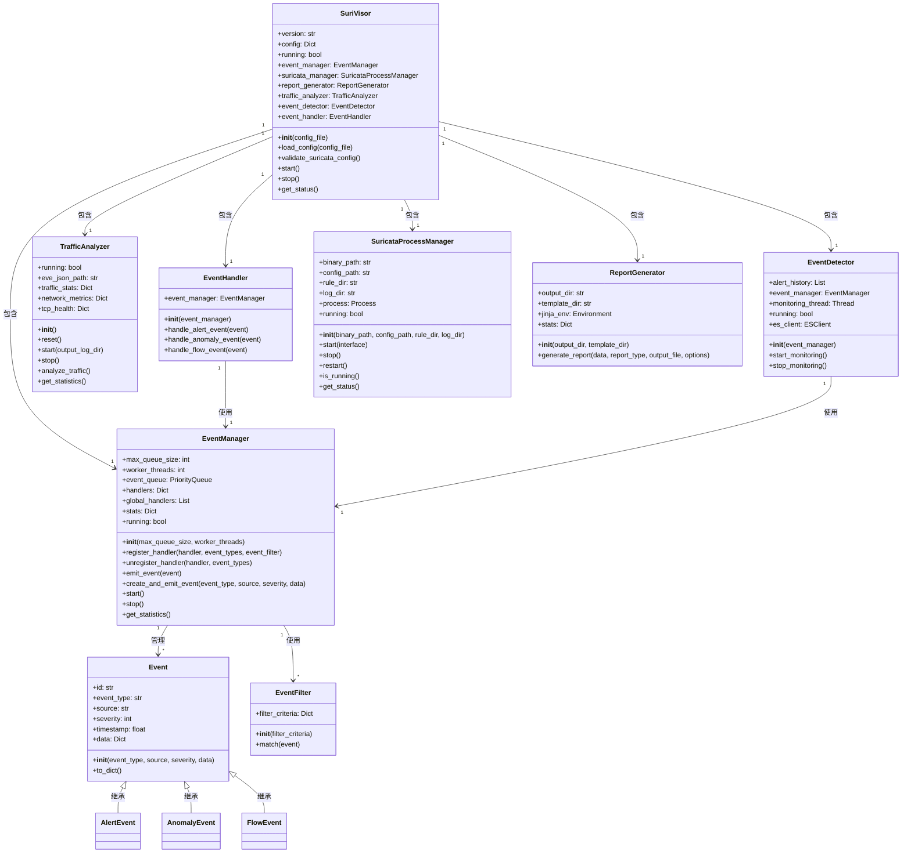

# SuriVisor 系统类关系图

以下Mermaid图表展示了SuriVisor系统中各个类之间的关系。

## 类关系说明

1. **SuriVisor**: 系统的主类，负责初始化和协调各个组件。包含以下主要组件：
   - EventManager: 事件管理器
   - SuricataProcessManager: Suricata进程管理器
   - ReportGenerator: 报告生成器
   - TrafficAnalyzer: 流量分析器
   - EventDetector: 事件检测器
   - EventHandler: 事件处理器

2. **事件相关类**:
   - Event: 事件基类，定义了事件的基本属性和方法
   - EventManager: 管理事件的注册、分发和处理
   - EventHandler: 处理不同类型的事件
   - EventFilter: 事件过滤器，用于过滤特定条件的事件

3. **流量分析相关类**:
   - TrafficAnalyzer: 流量分析器，分析网络流量并生成流量统计信息

4. **事件检测相关类**:
   - EventDetector: 事件检测器，检测网络异常并生成异常事件

5. **Suricata进程管理相关类**:
   - SuricataProcessManager: 管理Suricata进程，监控其运行状态

6. **报告生成相关类**:
   - ReportGenerator: 报告生成器，生成多种格式的分析报告

这种类关系设计使得系统具有良好的模块化和可扩展性，各个组件之间通过明确的接口进行交互，降低了系统的耦合度。