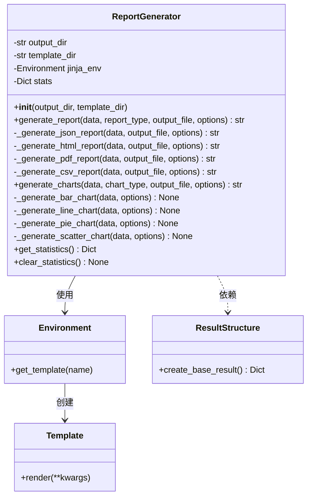
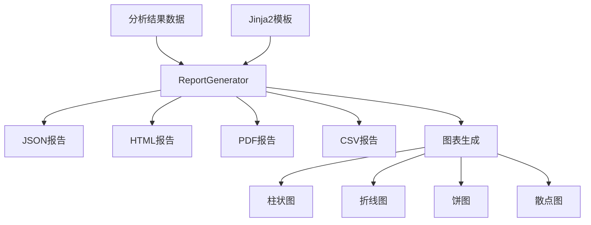

# ReportGenerator模块说明

## 模块概述

ReportGenerator模块是SuriVisor系统的报告生成组件，负责整合分析结果并生成多种格式的报告。该模块支持HTML、JSON、PDF和CSV等多种报告格式，并提供图表生成功能，可以生成柱状图、折线图、饼图和散点图等多种可视化图表。

## 主要功能

1. **多格式报告生成**：支持生成JSON、HTML、PDF和CSV格式的报告
2. **图表生成**：支持生成柱状图、折线图、饼图和散点图等多种图表
3. **模板支持**：使用Jinja2模板引擎支持自定义HTML报告模板
4. **统计功能**：记录报告生成的统计信息，如生成报告数量、类型分布和平均生成时间

## 类图



## 方法说明

### 初始化方法

- **__init__(output_dir, template_dir)**：初始化报告生成器，设置输出目录和模板目录

### 报告生成方法

- **generate_report(data, report_type, output_file, options)**：生成指定类型的报告
  - 支持的报告类型：json、html、pdf、csv
  - 根据报告类型调用相应的生成方法
  - 记录报告生成的统计信息

### 内部报告生成方法

- **_generate_json_report(data, output_file, options)**：生成JSON格式报告
- **_generate_html_report(data, output_file, options)**：生成HTML格式报告，支持Jinja2模板
- **_generate_pdf_report(data, output_file, options)**：生成PDF格式报告（通过HTML转换）
- **_generate_csv_report(data, output_file, options)**：生成CSV格式报告

### 图表生成方法

- **generate_charts(data, chart_type, output_file, options)**：生成指定类型的图表
  - 支持的图表类型：bar（柱状图）、line（折线图）、pie（饼图）、scatter（散点图）
  - 根据图表类型调用相应的生成方法

### 内部图表生成方法

- **_generate_bar_chart(data, options)**：生成柱状图
- **_generate_line_chart(data, options)**：生成折线图
- **_generate_pie_chart(data, options)**：生成饼图
- **_generate_scatter_chart(data, options)**：生成散点图

### 统计方法

- **get_statistics()**：获取报告生成器的统计信息
- **clear_statistics()**：清除统计信息

## 数据流图



## 使用示例

```python
# 创建报告生成器实例
report_generator = ReportGenerator()

# 准备报告数据
report_data = {
    "metadata": {
        "title": "网络流量分析报告",
        "author": "SuriVisor",
        "date": "2023-05-01"
    },
    "data": {
        "traffic_analysis": {
            "total_packets": 15000,
            "attacks": [
                {"type": "SQL注入", "confidence": 0.95, "source_ip": "192.168.1.100", "target_ip": "10.0.0.1", "timestamp": "2023-05-01T10:15:30"}
            ],
            "traffic_by_protocol": {
                "TCP": 10500,
                "UDP": 3000,
                "ICMP": 1000,
                "Other": 500
            }
        }
    }
}

# 生成HTML报告
html_report = report_generator.generate_report(report_data, "html")

# 生成JSON报告
json_report = report_generator.generate_report(report_data, "json")

# 生成CSV报告（仅导出攻击数据）
csv_options = {"data_path": "data.traffic_analysis.attacks"}
csv_report = report_generator.generate_report(report_data, "csv", options=csv_options)

# 生成流量协议分布饼图
chart_data = report_data["data"]["traffic_analysis"]["traffic_by_protocol"]
chart_options = {"title": "流量协议分布", "colors": ["#3498db", "#2ecc71", "#e74c3c", "#f39c12"]}
pie_chart = report_generator.generate_charts(chart_data, "pie", options=chart_options)

# 获取报告生成统计信息
stats = report_generator.get_statistics()
```