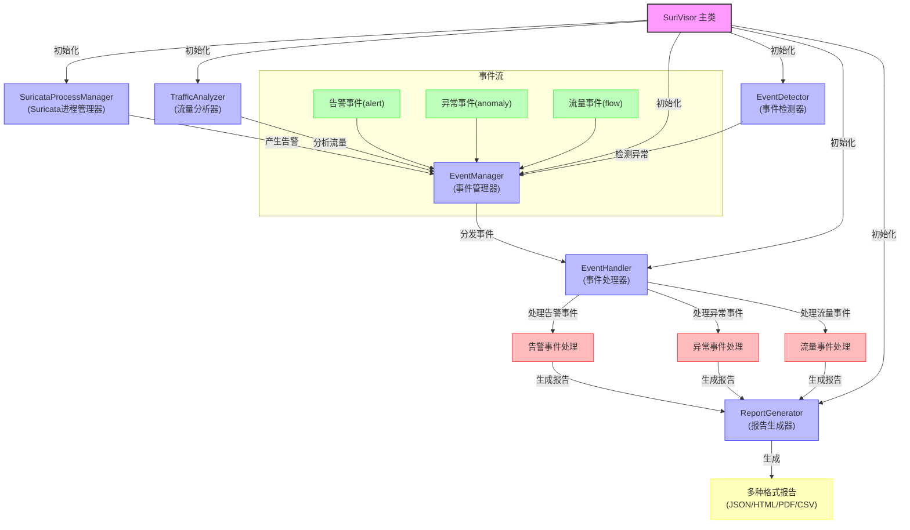

# SuriVisor 系统架构图

以下Mermaid图表展示了SuriVisor系统中各模块的调用关系和数据流向。

## 组件说明

1. **SuriVisor 主类**: 系统的核心类，负责初始化和协调各个组件
2. **SuricataProcessManager**: 管理Suricata进程，监控其运行状态
3. **TrafficAnalyzer**: 分析网络流量，识别流量模式
4. **EventDetector**: 检测网络异常，生成异常事件
5. **EventManager**: 管理事件的注册、分发和处理
6. **EventHandler**: 处理不同类型的事件
7. **ReportGenerator**: 生成多种格式的分析报告

## 事件流向

系统中的事件主要有三种类型：
- **告警事件(alert)**: 由Suricata生成的告警
- **异常事件(anomaly)**: 由事件检测器检测到的网络异常
- **流量事件(flow)**: 由流量分析器生成的流量统计信息

所有事件都通过事件管理器进行分发，由相应的事件处理器进行处理，最终可以生成分析报告。