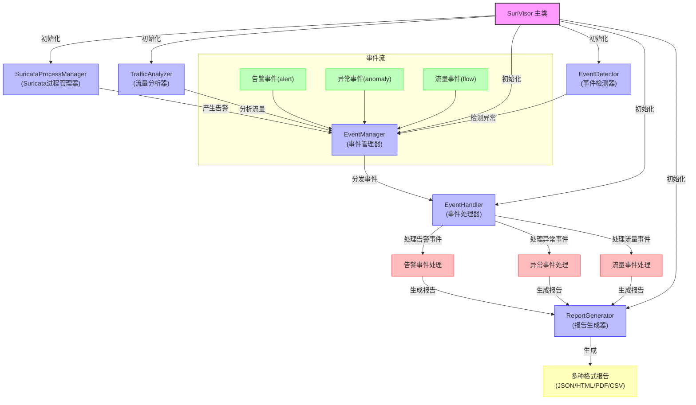
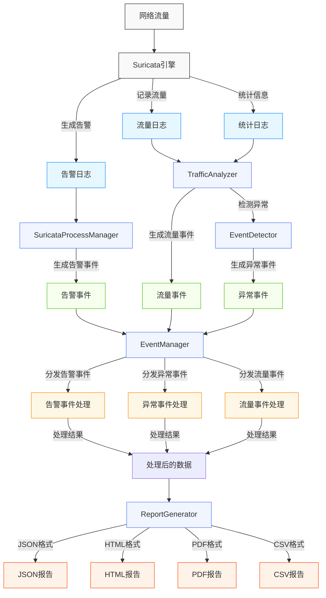
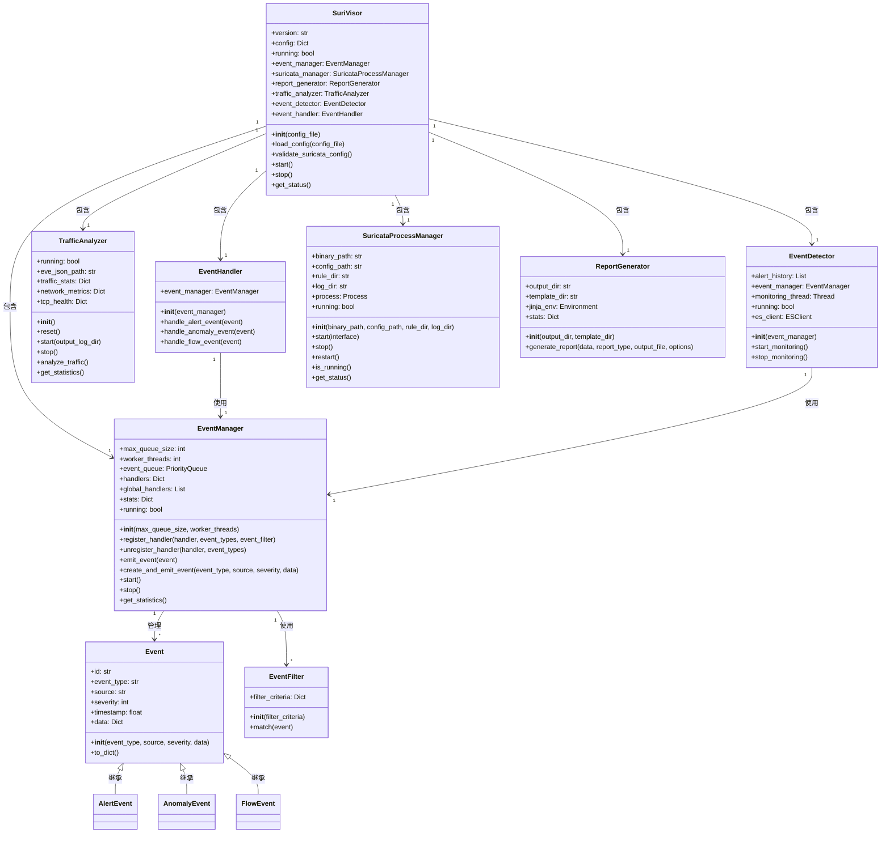

# SuriVisor 系统架构概览

本文档提供了SuriVisor系统的架构概览，包括系统组件、调用关系、数据流向和类关系。

## 目录

- [系统组件](#系统组件)
- [系统架构图](#系统架构图)
- [数据流向图](#数据流向图)
- [类关系图](#类关系图)
- [系统工作流程](#系统工作流程)

## 系统组件

SuriVisor系统由以下主要组件构成：

1. **SuriVisor主类**：系统的核心类，负责初始化和协调各个组件
2. **SuricataProcessManager**：管理Suricata进程，监控其运行状态
3. **TrafficAnalyzer**：分析网络流量，识别流量模式
4. **EventDetector**：检测网络异常，生成异常事件
5. **EventManager**：管理事件的注册、分发和处理
6. **EventHandler**：处理不同类型的事件
7. **ReportGenerator**：生成多种格式的分析报告

## 系统架构图

以下Mermaid图表展示了SuriVisor系统中各模块的调用关系：

## 数据流向图

以下Mermaid图表展示了SuriVisor系统中数据的流向和处理过程：

## 类关系图

以下Mermaid图表展示了SuriVisor系统中各个类之间的关系：

## 系统工作流程

1. **初始化阶段**：
   - SuriVisor主类加载配置文件
   - 初始化各个组件（SuricataProcessManager、TrafficAnalyzer、EventManager、EventDetector、EventHandler、ReportGenerator）
   - 注册各类事件处理器

2. **数据采集阶段**：
   - SuricataProcessManager启动Suricata进程
   - Suricata引擎捕获网络流量并进行分析
   - 生成告警日志、流量日志和统计日志

3. **数据处理阶段**：
   - SuricataProcessManager处理告警日志，生成告警事件
   - TrafficAnalyzer处理流量日志和统计日志，生成流量事件
   - EventDetector基于TrafficAnalyzer的分析结果检测异常，生成异常事件

4. **事件管理阶段**：
   - EventManager接收所有类型的事件
   - 根据事件类型将事件分发给相应的处理器

5. **事件处理阶段**：
   - EventHandler处理不同类型的事件
   - 告警事件处理器处理告警事件
   - 异常事件处理器处理异常事件
   - 流量事件处理器处理流量事件

6. **报告生成阶段**：
   - ReportGenerator根据处理后的数据生成多种格式的报告
   - 支持JSON、HTML、PDF和CSV等格式

这种模块化的设计使得系统具有良好的可扩展性和可维护性，各个组件之间通过明确的接口进行交互，降低了系统的耦合度。