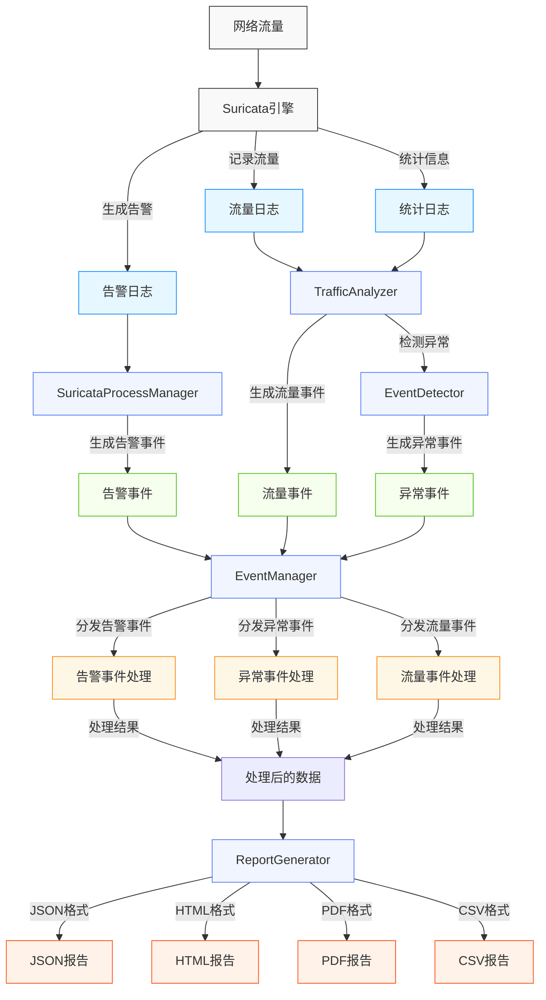

# SuriVisor 系统数据流向图

以下Mermaid图表展示了SuriVisor系统中数据的流向和处理过程。

## 数据流向说明

1. **数据采集阶段**:
   - 网络流量被Suricata引擎捕获和分析
   - Suricata生成告警日志、流量日志和统计日志

2. **数据处理阶段**:
   - SuricataProcessManager处理告警日志，生成告警事件
   - TrafficAnalyzer处理流量日志和统计日志，生成流量事件
   - EventDetector基于TrafficAnalyzer的分析结果检测异常，生成异常事件

3. **事件管理阶段**:
   - EventManager接收所有类型的事件
   - 根据事件类型将事件分发给相应的处理器

4. **事件处理阶段**:
   - 告警事件处理器处理告警事件
   - 异常事件处理器处理异常事件
   - 流量事件处理器处理流量事件

5. **报告生成阶段**:
   - ReportGenerator根据处理后的数据生成多种格式的报告
   - 支持JSON、HTML、PDF和CSV等格式

这种数据流向设计使得系统能够高效地处理和分析网络流量，及时发现并报告潜在的安全威胁。